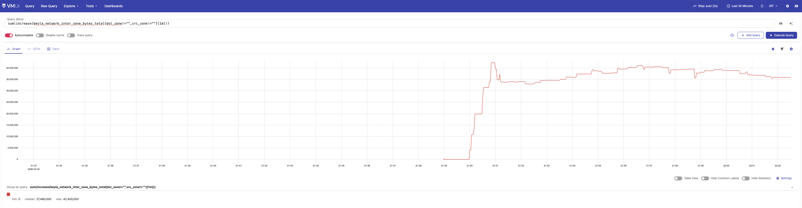
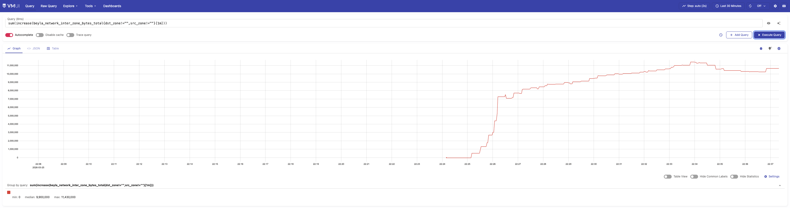

# Playground — Multi-AZ Kubernetes Cluster

A local Kubernetes environment that simulates an AWS multi-AZ deployment using [Kind](https://github.com/kubernetes-sigs/kind/).
Built as a companion to the KubeCon EU 2026 talk: **"[Cutting Metrics Traffic, Cutting Costs: The AZ-Aware Observability Blueprint](https://kccnceu2026.sched.com/event/2CW5m/cutting-metrics-traffic-cutting-costs-the-az-aware-observability-blueprint-iris-dyrmishi-rodrigo-fior-kuntzer-miro?iframe=no)"**.

## Cluster Topology

The Kind cluster simulates a single AWS region (`eu-west-1`) with 3 availability zones, using 8 nodes (2 control-plane + 6 workers):

```
eu-west-1
├── eu-west-1a
│   ├── control-plane (ingress-ready, hostPort 80 → 30080)
│   ├── worker-1
│   └── worker-2
├── eu-west-1b
│   ├── control-plane
│   ├── worker-1
│   └── worker-2
└── eu-west-1c
    ├── worker-1
    └── worker-2
```

Each node is labeled with the standard Kubernetes topology labels:
- `topology.kubernetes.io/region: eu-west-1`
- `topology.kubernetes.io/zone: eu-west-1{a,b,c}`

### HA Control Plane

Two control-plane nodes are spread across eu-west-1a and eu-west-1b. Kind automatically provisions an haproxy load balancer in front of the API servers. Note: with 2 nodes, etcd quorum is not fault-tolerant (requires 3 for true HA), but this is sufficient for simulating AZ topology.

### Control Plane Metrics

The cluster exposes all control plane metrics endpoints on `0.0.0.0` so they are scrapable from within the cluster:

| Component              | Port  |
|------------------------|-------|
| kube-proxy             | 10249 |
| kube-controller-manager| 10257 |
| kube-scheduler         | 10259 |
| etcd                   | 2381  |

### Post-Create Adjustments

After cluster creation, the Makefile automatically:
1. Patches CoreDNS with `topologySpreadConstraints` to spread replicas across zones
2. Deploys Envoy Gateway as the cluster ingress controller (see [envoy-gateway/](envoy-gateway/))

## Prerequisites

- [Kind](https://kind.sigs.k8s.io/) v0.27+
- [kubectl](https://kubernetes.io/docs/tasks/tools/)
- [Helmfile](https://helmfile.readthedocs.io/) + [Helm](https://helm.sh/)
- Container runtime: **Colima** or **Docker Desktop** (macOS)

## Quick Start

```bash
# Create the cluster (includes preflight checks + Envoy Gateway)
make create

# Check cluster status and node AZ distribution
make status

# Deploy the AZ-aware Prometheus stack
cd prometheus-agent-mode && make deploy

# Tear it down
make delete
```

## Makefile Targets

| Target      | Description                                          |
|-------------|------------------------------------------------------|
| `create`    | Run preflight, create cluster, patch CoreDNS, deploy Envoy Gateway |
| `delete`    | Delete the Kind cluster                              |
| `status`    | Show cluster info and node topology labels           |
| `kubeconfig`| Print the kubeconfig                                 |
| `preflight` | Detect container runtime and ensure inotify limits   |
| `help`      | List all targets                                     |

## Preflight Checks

Running 8 nodes (2 control-plane + 6 workers) inside Kind requires higher inotify limits than the macOS VM defaults. The `preflight` target automatically:

1. Detects whether you're running **Colima** or **Docker Desktop**
2. Checks `fs.inotify.max_user_watches` and `fs.inotify.max_user_instances` inside the VM
3. Bumps them to `524288` / `512` if below threshold

Without this, kube-proxy and other components fail with `too many open files`.

## Directory Structure

```
playground/
├── Makefile                       # Cluster lifecycle management
├── kind-config.yaml               # Kind cluster definition (8 nodes, 3 AZs, HA control plane)
├── README.md                      # This file
├── envoy-gateway/                 # Ingress controller setup (Envoy Gateway + Gateway API)
│   └── README.md
├── prometheus-agent-mode/         # AZ-aware Prometheus agents + central server
│   └── README.md
├── victoria-metrics-baseline/     # AZ-unaware VictoriaMetrics — the "before" state (high cross-AZ traffic)
├── victoria-metrics-cluster-mode/ # AZ-isolated VictoriaMetrics — the "after" state (minimized cross-AZ traffic)
│   └── README.md
├── podinfo/                       # Test workload — 25 replicas across AZs
└── beyla/                         # eBPF network observability — cross-AZ traffic measurement
```

## Ingress

The first control-plane node maps `hostPort:80 → containerPort:30080`. Envoy Gateway runs as a NodePort service on that port. A single shared Gateway named `playground` (in `envoy-gateway-system`) serves as the entry point for all `*.127.0.0.1.nip.io` hostnames. A ReferenceGrant allows HTTPRoutes from any namespace to attach to it — each platform and workload creates its own HTTPRoutes without needing to manage the Gateway itself.

See [envoy-gateway/README.md](envoy-gateway/README.md) for details.

## Deploying the Observability Stack

Three observability platforms are available — deploy one at a time (they all use the `monitoring` namespace):

### Option 0: VictoriaMetrics Baseline — the "before" state

Single VMAgent + single VMCluster with no AZ constraints. Components land on any node and scrape any target, generating high cross-AZ traffic. Use this to establish the baseline before applying AZ-aware optimizations.

```bash
cd victoria-metrics-baseline && make deploy
```

### Option 1: Prometheus Agent Mode (AZ-aware collection only)

Demonstrates AZ-aware metrics **collection** with per-AZ PrometheusAgents, but uses a single centralized Prometheus server (cross-AZ ingestion not solved).

```bash
cd prometheus-agent-mode && make deploy
```

See [prometheus-agent-mode/README.md](prometheus-agent-mode/README.md) for details.

### Option 2: VictoriaMetrics Cluster Mode (minimized cross-AZ traffic)

Per-AZ VMAgent → per-AZ VMCluster (vminsert/vmstorage/vmselect) → federated vmselect → VMAlert. Cross-AZ traffic is reduced to the bare minimum: only the federated vmselect queries per-AZ vmselect nodes across zone boundaries at read time. The write path (scraping + ingestion + storage) is fully AZ-local. True zero cross-AZ traffic is not achievable since queries must fan out to all AZs to provide a unified view.

```bash
cd victoria-metrics-cluster-mode && make deploy
```

See [victoria-metrics-cluster-mode/README.md](victoria-metrics-cluster-mode/README.md) for details.

## Workload: Podinfo

[Podinfo](https://github.com/stefanprodan/podinfo) is a lightweight Go microservice that exposes Prometheus metrics natively. It is deployed as a test workload to generate realistic metric volume and traffic patterns across the AZ-aware observability pipelines.

**Deploy after** one of the observability platforms above (the HTTPRoute references the `monitoring-gateway` created by them).

```bash
cd podinfo && make deploy
```

- 25 replicas spread evenly across the 3 AZs (~8-9 pods per zone) via `topologySpreadConstraints`
- ServiceMonitor with 15s scrape interval — picked up automatically by PrometheusAgents / VMAgents
- UI accessible at `http://podinfo.127.0.0.1.nip.io`

## Network Observability: Beyla

[Grafana Beyla](https://grafana.com/docs/beyla/latest/) uses eBPF to instrument network traffic at the kernel level with no code changes. It runs as a DaemonSet on every node and produces `beyla_network_inter_zone_bytes_total` — the metric that directly quantifies cross-AZ traffic per workload, making the cost impact of the observability pipeline visible.

**Deploy after** one of the observability platforms (Beyla's ServiceMonitor is discovered automatically):

```bash
cd beyla && make deploy
```

- One pod per node (8 total) via DaemonSet with `tolerations: - operator: Exists`
- Captures inter-zone network flows using eBPF socket filters with `preset: network`
- ServiceMonitor with 15s scrape interval

To check total cross-AZ bytes over the last minute (both zone labels must be known):

```promql
sum(increase(beyla_network_inter_zone_bytes_total{dst_zone!="",src_zone!=""}[1m]))
```

Run this query before and after deploying an AZ-aware platform to measure the traffic reduction.

### Example results

| Platform                        | Cross-AZ bytes/min |
|---------------------------------|--------------------|
| `victoria-metrics-baseline`     | ~37,480,000        |
| `victoria-metrics-cluster-mode` | ~9,900,000         |

**~74% reduction** in cross-AZ traffic from the AZ-aware setup.

**Baseline** (`victoria-metrics-baseline`) — single unaware stack:



**After** (`victoria-metrics-cluster-mode`) — per-AZ stack with AZ-aware agents:


